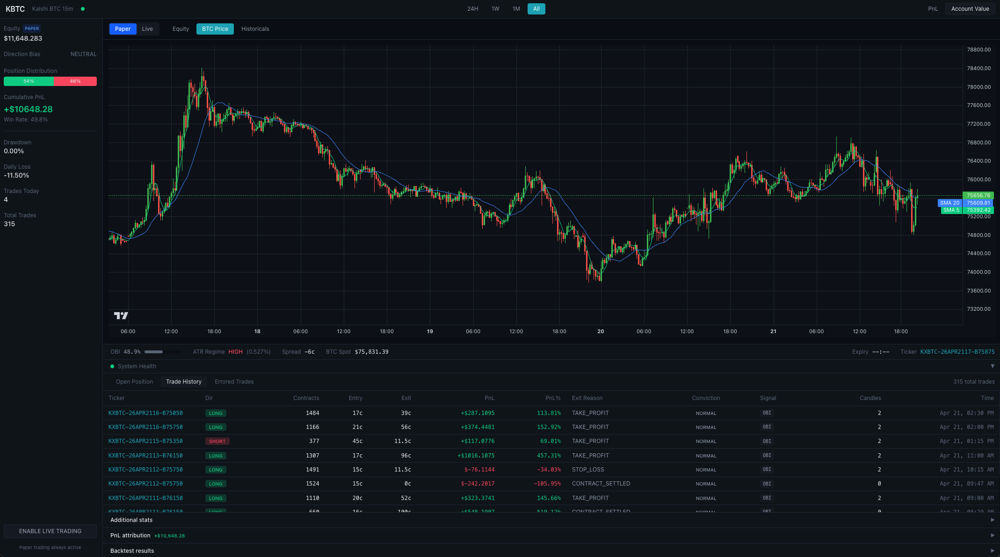

# KBTC -- Kalshi BTC 15-Minute Trading Bot

Automated trading bot for Kalshi's BTC 15-minute prediction markets. Combines Order Book Imbalance (OBI) and Rate of Change (ROC) momentum signals with ATR-based volatility regime filtering, automated risk management, and a real-time dashboard.



> Real-time dashboard: equity curve, BTC price with EMA overlays, OBI / ATR regime indicators, and live trade attribution. The screenshot above shows a paper-trading session — 315 trades, 49.5% win rate, +$10,648 cumulative PnL.

## Architecture

```
Coinbase Spot WS ──┐
                    ├─→ Coordinator ──→ Strategies ──→ Resolver ──→ Execution
Kalshi Order Book ──┘        │              │                          │
                             │         ATR Regime                Paper / Live
                             │           Filter                    Trader
                             ▼
                    ┌─── Dashboard ───┐
                    │  Equity Chart   │
                    │  BTC Price      │
                    │  Signals/OBI    │
                    │  Trade History  │
                    │  Attribution    │
                    │  Backtest Viz   │
                    │  System Health  │
                    └─────────────────┘
```

### Core Components

| Directory | Purpose |
|-----------|---------|
| `backend/strategies/` | OBI and ROC signal generators, signal conflict resolver |
| `backend/filters/` | ATR volatility regime filter (gates entries in HIGH regimes) |
| `backend/risk/` | Position sizer (fixed fractional) and circuit breaker (daily/weekly/drawdown limits) |
| `backend/execution/` | Paper trader (simulated fills) and live trader (Kalshi REST API) |
| `backend/data/` | Kalshi WebSocket, Coinbase spot feed, candle aggregator |
| `backend/backtesting/` | Simulation engine, walk-forward optimizer, auto-tuner, attribution, reports |
| `backend/monitoring/` | Signal health/decay monitoring (IC, win rate drift, Sharpe drift) |
| `backend/api/` | FastAPI REST endpoints and WebSocket feed for the dashboard |
| `frontend/` | React + TypeScript + Tailwind CSS dashboard with TradingView charts |

### Signal Flow

1. **Data ingestion** -- Coinbase spot price + Kalshi order book stream into the coordinator
2. **ATR regime check** -- If volatility is HIGH, block all new entries
3. **OBI evaluation** -- Order book imbalance above 0.65 = bullish, below 0.35 = bearish
4. **ROC evaluation** -- 15-minute price rate of change confirms momentum direction
5. **Resolver** -- OBI + ROC must agree or at least not conflict; conviction level set (HIGH/NORMAL/LOW)
6. **Position sizing** -- Fixed fractional sizing scaled by conviction and drawdown state
7. **Execution** -- Paper trader records simulated fill; live trader places real Kalshi orders

## Quick Start

### Prerequisites

- Docker and Docker Compose
- Node.js 18+ (for frontend development)
- Kalshi API key with RSA private key
- Python 3.11+ (for local backtesting)

### Local Development

```bash
# Clone and configure
cp .env.example .env
# Edit .env with your Kalshi API credentials and Discord webhooks

# Start database and bot
docker compose up -d

# Frontend development server (hot reload)
cd frontend && npm install && npm run dev
```

The dashboard is available at `http://localhost:5173` (dev) or `http://localhost:8001` (served from FastAPI).

### Production Deployment

```bash
# Deploy to DigitalOcean droplet
./scripts/deploy.sh botuser@your-server-ip
```

The deploy script rsyncs the project, adjusts ports for production, and rebuilds the container on the remote host. The frontend is pre-built and served as static files from `backend/static/`.

## Trading Modes

The bot supports two modes, switchable from the dashboard sidebar:

- **Paper** (default) -- Simulated fills, no real money. Uses its own bankroll, position sizer, and circuit breaker instance.
- **Live** -- Real orders via Kalshi REST API. Separate bankroll tracking. Requires confirmation and checks for open positions before switching.

A **trading pause** button on the dashboard halts new entries while still allowing open positions to exit normally.

## Backtesting and Strategy Tuning

### Roadmap

The bot's backtesting and tuning capabilities mature as more live data accumulates:

| Milestone | Data Required | What Unlocks |
|-----------|--------------|--------------|
| **Now** | Binance CSV (6 months, included) | Backtest strategy logic against spot BTC data; validate signal generation works |
| **~3 weeks** | 2,000+ live candles | Auto-tuner activates (runs every 6h); walk-forward with 1 window |
| **~2 months** | 8,000+ live candles | Walk-forward with multiple windows; statistically meaningful parameter optimization |
| **~3 months** | 12,000+ live candles + daily attribution history | Signal drift detection; session/regime profitability trends; full attribution time series |

### Running Backtests (Manual)

```bash
cd backend

# Backtest against Binance historical data
python -m backtesting run --csv ../data/candles_btc_15m.csv

# Backtest against live collected data (once enough accumulates)
python -m backtesting run --from-db --symbol BTC --source live_spot,binance

# Walk-forward optimization
python -m backtesting walk-forward --csv ../data/candles_btc_15m.csv

# Manual tuning cycle
python -m backtesting tune --from-db

# Generate HTML report from existing JSON
python -m backtesting report --input backtest_reports/latest.json
```

Results land in `backend/backtest_reports/` and are visible in the dashboard's **Backtest Results** panel. Full interactive HTML reports are accessible via the "Open full HTML report" button.

### Auto-Tuner (Automated)

The coordinator runs a tuning cycle every 6 hours:

1. Loads live candle and order book data from the database
2. Builds a parameter search grid around current settings
3. Runs walk-forward optimization with train/test splits
4. Evaluates whether the recommendation passes safety thresholds
5. Posts results to Discord; does **not** auto-apply by default

Parameter overrides can be viewed and cleared from the dashboard or via the API (`GET/DELETE /api/param-overrides`).

### Performance Attribution (Automated)

- **Daily** (00:05 UTC) -- Queries previous day's trades, runs full PnL attribution, persists to `daily_attribution` table, posts to Discord `#kbtc-attribution`
- **Weekly** (Sunday 00:10 UTC) -- Aggregates the week's daily attribution, detects session/regime drift (profitable-to-unprofitable flips), posts digest to Discord

Attribution breaks down PnL by conviction level, trading session (Asia/London/US), ATR regime, exit reason, and fee drag. Visible in the dashboard's **PnL Attribution** panel.

## ML/AI Training Pipeline

The bot passively collects 14 entry-time features at trade entry, labels outcomes at exit, and enriches each trade with MFE (max favorable excursion) and MAE (max adverse excursion) during the trade. This data feeds an XGBoost entry filter that learns to gate bad entries and size good ones more aggressively.

### Master Timeline

| Phase | Status | Data Required | Deliverables |
|-------|--------|---------------|--------------|
| **Phase 0** | Active | None (runs immediately) | MFE/MAE columns added to `trade_features`; tracked on every tick while a position is open; flushed to DB at exit |
| **Phase 1** | Accumulating | 500+ labeled paper trades | Paper bot runs 24/7 with circuit breakers disabled; Discord alert fires at 500 trades; checkpoint analysis at 300 |
| **Phase 2** | Pending | Phase 1 complete | Export `trade_features`, train XGBoost with 5-fold stratified CV, tune threshold for OOS precision >= 0.58, serialize to `ml/models/xgb_entry_v1.pkl` |
| **Phase 3** | Pending | Phase 2 complete | `ml/inference.py` loads model at startup; `ml_gate()` called after resolver fires; `p_win` feeds conviction override in position sizer |
| **Phase 4** | Pending | Phase 3 complete | Shadow mode on paper for 1 week; compare gate vs baseline win rate; promote to live if >= 5pp improvement confirmed |

### Features Captured (`trade_features` table)

| Category | Features |
|----------|----------|
| Signal | `obi`, `roc_3`, `roc_5`, `roc_10` |
| Volatility / Microstructure | `atr_pct`, `spread_pct`, `bid_depth`, `ask_depth` |
| Candle Context | `green_candles_3`, `candle_body_pct`, `volume_ratio` |
| Time Context | `time_remaining_sec`, `hour_of_day`, `day_of_week` |
| Trade Quality (exit-time) | `max_favorable_excursion`, `max_adverse_excursion` |
| Label | `label` (-1/0/+1), `pnl` |

### Design Principles

- **Fail-open**: If the model file is missing or inference throws, `ml_gate()` returns `(True, 0.5)` -- the trade proceeds as if the gate was not present
- **No feature leakage**: Only entry-time features are passed to `ml_gate()` during live inference; MFE/MAE improve label quality during training but are not available at entry
- **Paper-first**: The ML gate is validated on paper trading before promotion to live

### Training (Manual)

```bash
# Export labeled data from the remote DB
ssh botuser@167.71.247.154 "docker exec kbtc-db psql -U kalshi -d kbtc \
  -c \"COPY (SELECT * FROM trade_features WHERE label IS NOT NULL) TO STDOUT CSV HEADER\"" \
  > trade_features_export.csv

# Train the model
python scripts/train_xgb.py --csv trade_features_export.csv
```

## Dashboard

The dashboard is a single-page React app at the server's root URL.

| Section | What It Shows |
|---------|--------------|
| **Sidebar** | Bankroll, drawdown, daily/weekly loss, trade count, paper/live toggle, trading pause |
| **Equity / BTC Price** | Equity curve (PnL or account value) and BTC candlestick chart with time range filtering |
| **Signal Panel** | Live OBI %, bid/ask volumes, spread, spot price, ATR regime |
| **System Health** | WebSocket connection status, tick/candle counts, reconnect attempts |
| **Position Table** | Open position, closed trade history (paginated), errored/quarantined trades |
| **Additional Stats** | Best/worst/avg trade, daily PnL bar chart, win rate by regime |
| **PnL Attribution** | Conviction/session/regime breakdown tables, fee drag summary |
| **Backtest Results** | Latest backtest metrics, overfitting warnings, walk-forward recommendation, HTML report link |

## Discord Notifications

Five webhook channels, each independently configurable:

| Channel | Events |
|---------|--------|
| `#kbtc-trades` | Trade opened, trade closed |
| `#kbtc-risk` | Circuit breaker tripped/cleared, ATR regime change, sizing failure |
| `#kbtc-heartbeat` | Periodic heartbeat, 4h/24h performance summaries |
| `#kbtc-errors` | Bot start/stop, WebSocket disconnect, DB errors, quarantined trades |
| `#kbtc-attribution` | Daily attribution report, weekly attribution digest |

## Risk Management

- **Position sizing**: Fixed fractional (2% risk per trade), scaled by conviction (HIGH 1.3x, NORMAL 1.0x, LOW 0.65x) and reduced 50% during drawdowns
- **Circuit breaker**: Halts trading when daily loss exceeds 6%, weekly loss exceeds 15%, or drawdown exceeds 20%
- **ATR regime filter**: Blocks all new entries during HIGH volatility periods
- **Stop loss**: Hard 2% stop on every position
- **Rapid-fire detection**: Quarantines trades if 3+ exits occur within 60 seconds (prevents feedback loops)

## Database

PostgreSQL with TimescaleDB. Key tables:

| Table | Purpose |
|-------|---------|
| `candles` | 15-minute OHLCV from live feeds and Binance |
| `ob_snapshots` | Order book depth snapshots (every 30s) |
| `trades` | All completed trades with full metadata |
| `bankroll_history` | Equity curve snapshots |
| `signal_log` | Every signal evaluation (OBI/ROC/regime/decision) |
| `daily_attribution` | Daily PnL attribution snapshots |
| `param_recommendations` | Auto-tuner recommendations |
| `trade_features` | ML feature snapshots at entry, labeled at exit with MFE/MAE |
| `bot_state` | Key-value store for runtime state (bankroll, param overrides) |

## Orphan Safety Validation

The bot includes a two-layer validation system to ensure orphan/phantom position handling works correctly before live trading resumes after any position management changes.

### Layer 1: Incident Replay Suite (offline)

Deterministic tests that replay exact Kalshi API response sequences from real production incidents. Each test asserts that the current code handles the scenario correctly.

```bash
cd backend && python3 -m pytest tests/replay/ -v
```

Covers:
- **Settlement verify failure** (Trade 451/454) — no orphan created when verify exhausts retries
- **Phantom accumulation** (BUG-015) — 70+ reconciliation cycles do not inflate contract count
- **Restart persistence** — `_settled_tickers` survives snapshot/restore cycle
- **Exit cooldown race** — recently-exited ticker skipped for 90s during reconciliation
- **Orphan-to-trade dedup** — duplicate trade within 5min window is skipped
- **Full lifecycle** — enter → settle → restart → reconcile = 0 orphans

### Layer 2: Demo Live-Path Canary (72-hour runtime)

An isolated canary stack running the exact same live code path against Kalshi's demo API with a small bankroll. Validates that no orphans, desyncs, or duplicates occur under real market conditions.

```bash
# Launch canary stack on the droplet
bash scripts/canary_up.sh

# Check health
bash scripts/canary_status.sh

# After 72h, run the validation report
bash scripts/canary_report.sh

# Tear down
bash scripts/canary_down.sh        # preserve data
bash scripts/canary_down.sh --wipe  # full reset
```

The canary runs on ports 8100 (API) and 5434 (DB), fully isolated from production.

### Promotion Workflow

1. Run replay suite → all tests must pass
2. Deploy canary → `bash scripts/canary_up.sh`
3. Wait 72 hours
4. Run canary report → `bash scripts/canary_report.sh`
5. If all gates pass → safe to unpause live trading
6. Tear down canary → `bash scripts/canary_down.sh`

See `scripts/PROMOTION_GATES.md` for the full gate definitions.

## Tests

```bash
cd backend && python -m pytest tests/ -v
```

Unit tests cover: position sizer, circuit breaker, OBI strategy, ROC strategy, signal resolver, candle aggregator, ATR regime filter, paper trader, orphan incident replay, price guard, and trend guard.

## Environment Variables

See `.env.example` for the full list. Key variables:

| Variable | Description |
|----------|-------------|
| `KALSHI_API_KEY_ID` | Kalshi API key |
| `KALSHI_PRIVATE_KEY_PATH` | Path to RSA private key for request signing |
| `KALSHI_ENV` | `demo` or `prod` |
| `TRADING_MODE` | `paper` or `live` |
| `INITIAL_BANKROLL` | Starting bankroll in dollars |
| `DISCORD_*_WEBHOOK` | Webhook URLs for trades, risk, heartbeat, errors, attribution channels |
| `TUNING_INTERVAL_HOURS` | How often the auto-tuner runs (default: 6) |
